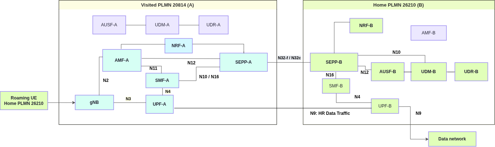

# End-to-end 5G SA Home-Routed Roaming with OAI 5G Core Network

In this tutorial, a UE from the **home PLMN 26210** connects to the **visited PLMN 20814** using **Home-Routed (HR) roaming**. It is the companion of the [LBO roaming tutorial](./LBO_ROAMING_TEST.md) and uses the same two networks, SEPPs and subscriber. The difference is the PDU session: the home subscription does not allow local breakout, so the session is anchored in the home network.

- The visited AMF selects a **V-SMF** in its own PLMN and discovers the **H-SMF** of the home PLMN through the NRFs and SEPPs.
- The V-SMF creates the PDU session on the H-SMF over **N16** (`Nsmf_PDUSession`, TS 29.502), relayed by the SEPPs over N32.
- The H-SMF retrieves the subscription from the home UDM, **allocates the UE address from the home pool**, and registers in the home UDM.
- User plane: gNB → **V-UPF** (N3) → **N9** GTP-U tunnel over the inter-PLMN network → **H-UPF** → N6. Traffic leaves the network in the home PLMN.



| | LBO | Home-routed |
|---|---|---|
| Home subscription (`lboRoamingAllowed` for DNN `oai` in 208/14) | `true` | `false` |
| SMF(s) | V-SMF only | V-SMF + H-SMF (N16 via SEPPs) |
| UE address | visited pool `12.1.1.128/25` | home pool `12.2.1.128/25` |
| N6 breakout | visited UPF | home UPF, via N9 |

## 1. Prerequisites: build the images

The home-routed changes are on the `hr-roaming-support` branch of the AMF, SMF and UPF repositories, and the test bed and this tutorial on the `master` branch of this SEPP repository. HR images use the tag `roaming-hr`. Build them with `build_images.sh` from `scripts/test`:

```bash
git checkout master
cd scripts/test
IMAGE_TAG=roaming-hr AMF_BRANCH=hr-roaming-support SMF_BRANCH=hr-roaming-support \
  UPF_BRANCH=hr-roaming-support SEPP_BRANCH=master ./build_images.sh
```

The script builds all core NFs first, then UERANSIM.

| Component | Branch | Image tag |
|---|---|---|
| AMF, SMF, UPF | `hr-roaming-support` | `oai-<nf>:roaming-hr` |
| NRF, UDM, UDR | `lbo-roaming-support` | `oai-<nf>:roaming-hr` |
| AUSF | `develop` | `oai-ausf:roaming-hr` |
| SEPP | `master` | `oai-sepp:roaming-hr` |
| UERANSIM | Repository default | `ueransim:roaming-lbo` |

Core NF sources are from [OpenAirInterface](https://github.com/openairinterface), as for LBO. `--plan` prints the selection without building and `--check` verifies that every branch exists.

The AMF and SMF are built on Ubuntu 24.04 (`BASE_IMAGE_AMF`/`BASE_IMAGE_SMF`, default `ubuntu:noble`); their build scripts reject 22.04.

## 2. Start both networks

Stop the LBO deployment first; both deployments use the same container names and networks. From `scripts/test`:

```bash
docker compose -f docker-compose-basic-nrf-hr-roaming.yaml up -d
python3 align_sepp_interfaces.py docker-compose-basic-nrf-hr-roaming.yaml
python3 setup_n9_routing.py
docker compose -f docker-compose-basic-nrf-hr-roaming.yaml ps
```

Use `docker-compose` instead if the host has Compose v1. Run both scripts before the UE starts (it waits 50 s).

`setup_n9_routing.py` attaches the V-UPF (`192.168.72.139`) and the H-UPF (`192.168.72.239`) to the inter-PLMN network shared by the SEPPs and routes each peer's GTP-U address through it. Each UPF keeps its N3/N4/N6 interface in its own PLMN, so the N9 tunnel crosses the inter-PLMN network like IPX:

```text
oai-upf-A: connected to oai-public-roam as 192.168.72.139
oai-upf-B: connected to oai-public-roam as 192.168.72.239
oai-upf-A: N9 to oai-upf-B GTP-U 192.168.73.139 via 192.168.72.239
oai-upf-B: N9 to oai-upf-A GTP-U 192.168.71.139 via 192.168.72.139
```

| Test setting | Value |
|---|---|
| UE | `imsi-262100000000031` |
| Home → visited PLMN | `26210` → `20814` |
| DNN | `oai`, LBO not allowed in 20814 (`hr_roaming_subscription_B.sql`) |
| Slice | SST `222`, SD `00007B` |
| UE address pool | `12.2.1.128/25` (H-SMF, PLMN B) |

The HR deployment uses its own database volumes (`oai-hr-mysql-a`, `oai-hr-mysql-b`); the LBO volumes are not touched.

## 3. Run and verify

The UE registers, establishes its PDU session and runs the data traffic test automatically.

```bash
docker logs -f ue-plmnB-roaming-A
docker exec ue-plmnB-roaming-A nr-cli imsi-262100000000031 -e status
docker exec ue-plmnB-roaming-A nr-cli imsi-262100000000031 -e ps-list
```

Confirm successful registration, an active IPv4 session on `oai` with an address from `12.2.1.128/25`, and successful data traffic:

```text
[nas] [info] Initial Registration is successful
[nas] [info] PDU Session establishment is successful PSI[1]
[app] [info] Connection setup for PDU session[1] is successful, TUN interface[uesimtun0, 12.2.1.130] is up.
PING google.com (142.251.39.238) from 12.2.1.130 uesimtun0: 56(84) bytes of data.
64 bytes from 142.251.39.238: icmp_seq=1 ttl=116 time=20.9 ms
64 bytes from 142.251.39.238: icmp_seq=2 ttl=116 time=21.9 ms
64 bytes from 142.251.39.238: icmp_seq=3 ttl=116 time=20.8 ms
3 packets transmitted, 3 received, 0% packet loss, time 2003ms
```

```text
PDU Session1:
 state: PS-ACTIVE
 session-type: IPv4
 apn: oai
 address: 12.2.1.130
 ambr: up[100Mb/s] down[100Mb/s]
```

The release path over N16 can be exercised with a deregistration. The UE then registers again and gets a new home-routed session:

```bash
docker exec ue-plmnB-roaming-A nr-cli imsi-262100000000031 -e "deregister normal"
```

## 4. Logs and HR test capture

To capture on the PLMN A, inter-PLMN and PLMN B bridges, start this right after `up -d` (it waits for the bridges and needs no host tcpdump):

```bash
python3 capture_pcap.py --output logs-hr/oai-5gc-hr-roaming.pcap --seconds 150
```

Selected excerpts from the same run follow:-

**HR data traffic — user plane in the capture**

The N9 tunnel between the V-UPF and the H-UPF, and the UE's traffic leaving from the H-UPF (SNAT to `192.168.73.139`), not from the visited network:

```text
00:20:12.380285 IP 192.168.71.139.2152 > 192.168.73.139.2152: UDP, length 104      <- N9 uplink
00:20:12.380789 IP 192.168.73.139 > 142.251.39.238: ICMP echo request, id 45571, seq 1   <- N6 at H-UPF
00:20:12.398102 IP 142.251.39.238 > 192.168.73.139: ICMP echo reply, id 45571, seq 1
00:20:12.398435 IP 192.168.73.139.2152 > 192.168.71.139.2152: UDP, length 100      <- N9 downlink
```

**Visited AMF-A Logs — HR selection**

```text
[amf_sbi] [info] Selected home SMF http://smf.5gc.mnc10.mcc262.3gppnetwork.org:8080 via local NRF and SEPP
[amf_sbi] [info] LBO not authorized by home subscription for DNN oai: home-routed PDU session, H-SMF http://smf.5gc.mnc10.mcc262.3gppnetwork.org:8080/nsmf-pdusession/v1
[amf_sbi] [debug] Message body {"anType":"3GPP_ACCESS","dnn":"oai", ... "hSmfUri":"http://smf.5gc.mnc10.mcc262.3gppnetwork.org:8080/nsmf-pdusession/v1", ... "pduSessionId":1, ... "servingNetwork":{"mcc":"208","mnc":"14"}, ... "supi":"imsi-262100000000031", ...}
```

```text
   |  Index |     5GMM State     |                IMSI/SUPI               |        GUTI        |   RAN UE NGAP ID   |   AMF UE NGAP ID   |        PLMN        |       Cell Id      |
   |    1   |   5GMM-REGISTERED  |             262100000000031            |20814010041325470853|        0x02        |        0x02        |       208,14       |      000000010     |
```

**Visited V-SMF-A Logs**

```text
[smf_app] [info] Home-routed PDU session (H-SMF http://smf.5gc.mnc10.mcc262.3gppnetwork.org:8080/nsmf-pdusession/v1), SUPI imsi-262100000000031, DNN oai
[smf_app] [info] Home-routed PDU session: Nsmf_PDUSession_Create to H-SMF http://smf.5gc.mnc10.mcc262.3gppnetwork.org:8080/nsmf-pdusession/v1, V-UPF N9 F-TEID ID 0x80000001 - IP: 192.168.71.139
[smf_sbi] [info] Send inter-PLMN request to http://smf.5gc.mnc10.mcc262.3gppnetwork.org:8080 via local SEPP http://sepp.5gc.mnc14.mcc208.3gppnetwork.org:8080
[smf_app] [info] Home-routed PDU session created on the H-SMF: http://smf.5gc.mnc10.mcc262.3gppnetwork.org:8080/nsmf-pdusession/v1/pdu-sessions/1, UE IPv4 12.2.1.130, H-UPF N9 F-TEID ID 0x1 - IP: 192.168.73.139, Session AMBR UL 100Mbps DL 100Mbps, 5QI 6
[smf_app] [info] Home-routed PDU session: UE IPv4 Address 12.2.1.130 allocated by the H-SMF
...
[smf_app] [info] Home-routed PDU session: Nsmf_PDUSession_Release to H-SMF http://smf.5gc.mnc10.mcc262.3gppnetwork.org:8080/nsmf-pdusession/v1/pdu-sessions/1/release
```

**SEPP-A / SEPP-B Logs — N16 over N32 (PRINS)**

```text
SEPP-A [sepp_app] [info] Forwarding NF service request: authority=smf.5gc.mnc10.mcc262.3gppnetwork.org:8080, path=/nsmf-pdusession/v1/pdu-sessions, method=POST
SEPP-B [sepp_app] [info] Decrypted JOSE incoming payload: {"anType":"3GPP_ACCESS","dnn":"oai","pduSessionId":1,"ratType":"NR","requestType":"INITIAL_REQUEST","sNssai":{"sd":"00007b","sst":222},"servingNetwork":{"mcc":"208","mnc":"14"},"supi":"imsi-262100000000031","vcnTunnelInfo":{"gtpTeid":"80000001","ipv4Addr":"192.168.71.139"},"vsmfId":"5f8988cc-c306-45b7-ba5c-3c5dfee6b177","vsmfPduSessionUri":"http://smf.5gc.mnc14.mcc208.3gppnetwork.org:8080/nsmf-pdusession/v1/vsmf-pdu-sessions/1"}
SEPP-B [sepp_app] [info] Sending local HTTP request to target NF: http://smf.5gc.mnc10.mcc262.3gppnetwork.org:8080/nsmf-pdusession/v1/pdu-sessions
SEPP-A [sepp_app] [info] Forwarding NF service request: authority=smf.5gc.mnc10.mcc262.3gppnetwork.org:8080, path=/nsmf-pdusession/v1/pdu-sessions/1/release, method=POST
```

**Home H-SMF-B Logs** — the UE address is allocated in the home PLMN, from the pool of DNN `oai` (`12.2.1.128/25`)

```text
[smf_api] [info] Received a PDU session create request from a V-SMF.
[smf_app] [info] Handle Nsmf_PDUSession_Create from V-SMF (home-routed PDU session), SUPI imsi-262100000000031, PDU Session ID 1, DNN oai, serving PLMN 20814, V-UPF N9 TEID 0x80000001 IP 192.168.71.139
[smf_sbi] [debug] Response from UDM [{"dnnConfigurations":{"oai":{"5gQosProfile":{"5qi":6, ...},"pduSessionTypes":{"defaultSessionType":"IPV4"},"sessionAmbr":{"downlink":"100Mbps","uplink":"100Mbps"},"sscModes":{"defaultSscMode":"SSC_MODE_1"}}},"singleNssai":{"sd":"00007b","sst":222}}]
[smf_app] [debug] UE Address Allocation
[smf_app] [info] Find DNN configuration with DNN oai
[smf_app] [debug] PDU Session Type IPv4
[smf_app] [info] PAA, Ipv4 Address: 12.2.1.130
[smf_app] [info] Home-routed PDU session: reply to the V-SMF, UE IPv4 12.2.1.130, H-UPF N9 F-TEID ID 0x1 - IP: 192.168.73.139, resource http://smf.5gc.mnc10.mcc262.3gppnetwork.org:8080/nsmf-pdusession/v1/pdu-sessions/1
[smf_sbi] [debug] UDM's URI: http://udm.5gc.mnc10.mcc262.3gppnetwork.org:8080/nudm-uecm/v1/imsi-262100000000031/registrations/smf-registrations/1
[smf_app] [info] Set PDU Session Status to PDU Session Status Active
[smf_app] [info] Set upCnxState to UPCNX_STATE_ACTIVATED
[smf_app] [info] SMF context:

SMF CONTEXT:
SUPI:				imsi-262100000000031
PDU SESSION:
	PDU Session ID:			1
	DNN:			oai
	S-NSSAI:			sst, sd: 222, 00007b
	PDN type:		IPV4
	PAA IPv4:		12.2.1.130
...
[smf_api] [info] Received a PDU session release request from a V-SMF.
[smf_app] [info] Handle Nsmf_PDUSession_Release from V-SMF, PDU session 1
[smf_sbi] [debug] Deregister with UDM for this PDU Session, response from UDM
```

**Visited V-UPF-A Logs** — N3 ⇄ N9 relay: the uplink goes to the H-UPF, the downlink is received on the N9 TEID `0x80000001`

```text
[upf_n4 ] [info] N9 downlink PDR, TEID 0x80000001 (received from CP)
  │  PDR   │  FAR  │  QER  │  URR  │  BAR  │  MAR  │ Precedence │ Direction │    UE IPv4      │   Action   │  Dest If   │  QFI  │       Create Outer Hdr         │       Remove Outer Hdr         │
  │ 1      │ 1     │ -     │ -     │ -     │ -     │ 0          │ UL        │ 12.2.1.130      │ FORW       │ CORE       │ -     │ GTP → 192.168.73.139:0x1       │ GTP TEID:0x1                   │
  │ 2      │ 2     │ -     │ -     │ -     │ -     │ 0          │ DL        │ 12.2.1.130      │ FORW       │ ACCESS     │ -     │ GTP → 192.168.71.140:0x1       │ GTP TEID:0x80000001            │
```

**Home H-UPF-B Logs** — N9 from the V-UPF, N6 breakout, downlink to the V-UPF

```text
  │  PDR   │  FAR  │  QER  │  URR  │  BAR  │  MAR  │ Precedence │ Direction │    UE IPv4      │   Action   │  Dest If   │  QFI  │       Create Outer Hdr         │       Remove Outer Hdr         │
  │ 1      │ 1     │ -     │ -     │ -     │ -     │ 0          │ UL        │ 12.2.1.130      │ FORW       │ CORE       │ -     │ -                              │ GTP TEID:0x1                   │
  │ 2      │ 2     │ -     │ -     │ -     │ -     │ 0          │ DL        │ 12.2.1.130      │ FORW       │ ACCESS     │ -     │ GTP → 192.168.71.139:0x80000001 │ -                              │
```

| Artifact | Visited PLMN (A) | Home PLMN (B) |
|---|---|---|
| AMF | [AMF-A](../scripts/test/logs-hr/oai-amf-A.txt) | [AMF-B](../scripts/test/logs-hr/oai-amf-B.txt) |
| SMF | [V-SMF](../scripts/test/logs-hr/oai-smf-A.txt) | [H-SMF](../scripts/test/logs-hr/oai-smf-B.txt) |
| UPF | [V-UPF](../scripts/test/logs-hr/oai-upf-A.txt) | [H-UPF](../scripts/test/logs-hr/oai-upf-B.txt) |
| NRF | [NRF-A](../scripts/test/logs-hr/oai-nrf-A.txt) | [NRF-B](../scripts/test/logs-hr/oai-nrf-B.txt) |
| AUSF | [AUSF-A](../scripts/test/logs-hr/oai-ausf-A.txt) | [AUSF-B](../scripts/test/logs-hr/oai-ausf-B.txt) |
| UDM | [UDM-A](../scripts/test/logs-hr/oai-udm-A.txt) | [UDM-B](../scripts/test/logs-hr/oai-udm-B.txt) |
| UDR | [UDR-A](../scripts/test/logs-hr/oai-udr-A.txt) | [UDR-B](../scripts/test/logs-hr/oai-udr-B.txt) |
| SEPP | [SEPP-A](../scripts/test/logs-hr/oai-sepp-A.txt) | [SEPP-B](../scripts/test/logs-hr/oai-sepp-B.txt) |
| Roaming UE | [UE log](../scripts/test/logs-hr/ueransim-vplmnA.txt) | — |
| HR test PCAP | [Download capture](../scripts/test/logs-hr/oai-5gc-hr-roaming.pcap) | Both PLMNs and the inter-PLMN network |

[All logs](../scripts/test/logs-hr/) · [Test details](../scripts/test/logs-hr/results.json)

To refresh complete logs after the traffic test, run:

```bash
python3 capture_lbo_logs.py --compose docker-compose-basic-nrf-hr-roaming.yaml --output logs-hr
```

## 5. Limitations

- One V-UPF and one H-UPF per session; no I-UPF/ULCL insertion, handover or PDU session modification over N16 (`Nsmf_PDUSession_Update`).
- The V-SMF allocates the V-UPF N9 TEID (upper half of the TEID space, TS 29.244 CP F-TEID allocation) so it can be sent to the H-SMF before the V-UPF session exists.
- N1 SM containers are not carried over N16: the SEPP (PRINS) relays JSON bodies only, so the V-SMF builds the NAS PDU Session Establishment Accept from the parameters the H-SMF authorizes. The H-SMF does not send V-SMF callbacks (`vsmfPduSessionUri`).
- IPv4 PDU sessions only.

## 6. Stop

```bash
docker compose -f docker-compose-basic-nrf-hr-roaming.yaml down
```
