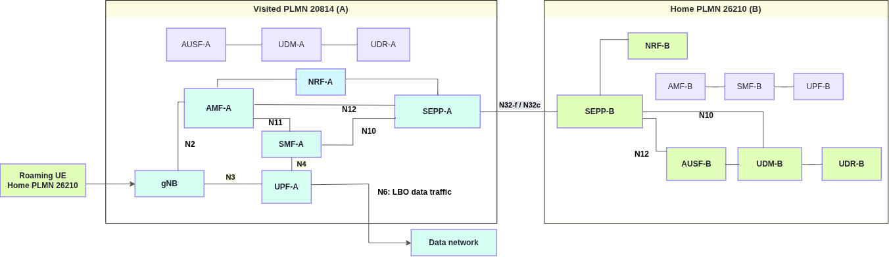

# End-to-end 5G SA LBO Roaming with OAI 5G Core Network

In this tutorial, a UE from the **home PLMN 26210** connects to the **visited PLMN 20814** using **Local Breakout (LBO) roaming**. The tutorial covers the **5G roaming signalling and user-plane procedures** for establishing an LBO connection. This includes **inter-PLMN communication via the SEPP**, UE authentication and subscriber information retrieval from the home network, and **PDU session establishment in the visited network**.




## 1. Prerequisites: build the images

Build required images by running `build_images.sh` from the SEPP repository:

```bash
cd scripts/test
./build_images.sh
```

The script builds all core NFs first, then UERANSIM.

| Component | Branch | Image tag |
|---|---|---|
| AMF, SMF, NRF, UDM, UDR | `lbo-roaming-support` | `oai-<nf>:roaming-lbo` |
| AUSF, UPF | `develop` | `oai-<nf>:roaming-lbo` |
| SEPP | Repository default | `oai-sepp:roaming-lbo` |
| UERANSIM | Repository default | `ueransim:roaming-lbo` |

Core NF sources are from [OpenAirInterface](https://github.com/openairinterface). SEPP uses this checkout's origin repository. UERANSIM uses [rohanrkharade/UERANSIM](https://github.com/rohanrkharade/UERANSIM). Set `SEPP_BRANCH=master` if that branch is required.

## 2. Start both networks

From `scripts/test`:

```bash
docker compose -f docker-compose-basic-nrf-lbo-roaming.yaml up -d
python3 align_sepp_interfaces.py
docker compose -f docker-compose-basic-nrf-lbo-roaming.yaml ps
```

Use `docker-compose` instead if the host has Compose v1.

| Test setting | Value |
|---|---|
| UE | `imsi-262100000000031` |
| Home → visited PLMN | `26210` → `20814` |
| DNN | `oai` |
| Slice | SST `222`, SD `00007B` |

Network settings are in `conf/roaming_config_partnerA.yaml` and `conf/roaming_config_partnerB.yaml`. The UE uses `conf/ueransim/ue-plmnB.yaml`. Existing database volumes are preserved.

## 3. Run and verify

The UE automatically registers, establishes its PDU session, and performs the LBO data traffic test.

```bash
docker logs -f ue-plmnB-roaming-A
docker exec ue-plmnB-roaming-A nr-cli imsi-262100000000031 -e status
docker exec ue-plmnB-roaming-A nr-cli imsi-262100000000031 -e ps-list
```

Confirm successful registration, an active IPv4 session on `oai`, and successful data traffic through the visited UPF.

## 4. Logs and LBO test capture


Selected excerpts from the same run follow:-

**LBO data traffic — UE ping**

```text
PING google.com (142.251.31.113) from 12.1.1.130 uesimtun0: 56(84) bytes of data.
64 bytes from 142.251.31.113: icmp_seq=1 ttl=105 time=32.2 ms
64 bytes from 142.251.31.113: icmp_seq=2 ttl=105 time=25.9 ms
64 bytes from 142.251.31.113: icmp_seq=3 ttl=105 time=24.4 ms

--- google.com ping statistics ---
3 packets transmitted, 3 received, 0% packet loss, time 2002ms
rtt min/avg/max/mdev = 24.443/27.509/32.204/3.370 ms
```

**Visited AMF-A Logs**

```text
2026-09-19T19:52:34.348425963Z [2026-09-19 21:52:34.348] [amf_app] [debug] Handle NF Update response
2026-09-19T19:52:34.348443557Z [2026-09-19 21:52:34.348] [amf_app] [debug] Set a timer to the next Heart-beat (10)
2026-09-19T19:52:42.829208561Z [2026-09-19 21:52:42.828] [amf_app] [info] 
2026-09-19T19:52:42.829286469Z    |------------------------------------------------------------------------------------------------------------------------------------------------------------|
2026-09-19T19:52:42.829300953Z    |----------------------------------------------------------------------gNBs' Information---------------------------------------------------------------------|
2026-09-19T19:52:42.829310499Z    |  Index |               Status               |              Global Id             |              gNB Name              |                PLMN                |
2026-09-19T19:52:42.829319242Z    |    1   |              Connected             |                0x01                |        UERANSIM-gnb-208-14-1       |               208,14               |
2026-09-19T19:52:42.829327904Z    |------------------------------------------------------------------------------------------------------------------------------------------------------------|
2026-09-19T19:52:42.829336693Z 
2026-09-19T19:52:42.829344333Z    |-----------------------------------------------------------------------------------------------------------------------------------------------------------|
2026-09-19T19:52:42.829353852Z    |---------------------------------------------------------------------UEs' Information----------------------------------------------------------------------|
2026-09-19T19:52:42.829362488Z    |  Index |     5GMM State     |                IMSI/SUPI               |        GUTI        |   RAN UE NGAP ID   |   AMF UE NGAP ID   |        PLMN        |       Cell Id      |
2026-09-19T19:52:42.829371230Z    |    1   |   5GMM-REGISTERED  |             262100000000031            |20814010041304846098|        0x01        |        0x03        |       208,14       |      000000010     |
2026-09-19T19:52:42.829380617Z    |-----------------------------------------------------------------------------------------------------------------------------------------------------------|
2026-09-19T19:52:42.829427179Z 
2026-09-19T19:52:44.349078435Z [2026-09-19 21:52:44.348] [amf_sbi] [info] Receive Update NF Instance Request, handling ...
```
**Home AUSF-B Logs**

```text
2026-09-19T18:59:19.283074148Z [2026-09-19 20:59:19.282] [ausf_app] [info] supiOrSuci imsi-262100000000031
2026-09-19T18:59:19.283525973Z [2026-09-19 20:59:19.283] [ausf_app] [debug] UDM's URI http://udm.5gc.mnc10.mcc262.3gppnetwork.org:8080/nudm-ueau/v1/imsi-262100000000031/security-information/generate-auth-data
2026-09-19T18:59:19.283562983Z [2026-09-19 20:59:19.283] [ausf_app] [info] Received authInfo from AMF without ResynchronizationInfo IE
2026-09-19T18:59:19.283637647Z [2026-09-19 20:59:19.283] [ausf_client] [debug] Send a simple HTTP request
2026-09-19T18:59:19.342055589Z [2026-09-19 20:59:19.341] [ausf_app] [info] Response from UDM: {"authType":"5G_AKA","authenticationVector":{"autn":"78b327dff2f280009344cc03410e8828","avType":"5G_HE_AKA","kausf":"5dbf748cd17281758366186646e7768d0e2de0549078ca0d7d59a9393c8243f8","rand":"2c81d24f132d5b03119524f4dfb67711","xresStar":"e2c5d85368aef7267c822030865d36bc"},"supi":"imsi-262100000000031"}
2026-09-19T18:59:19.342102910Z [2026-09-19 20:59:19.341] [ausf_app] [debug] authType 5G_AKA
2026-09-19T18:59:19.342113900Z [2026-09-19 20:59:19.341] [ausf_app] [debug] autn_udm 78b327dff2f280009344cc03410e8828
2026-09-19T18:59:19.342122441Z [2026-09-19 20:59:19.341] [ausf_app] [debug] av_type_udm 5G_HE_AKA
2026-09-19T18:59:19.342130640Z [2026-09-19 20:59:19.341] [ausf_app] [debug] kausf_udm 5dbf748cd17281758366186646e7768d0e2de0549078ca0d7d59a9393c8243f8
2026-09-19T18:59:19.342138896Z [2026-09-19 20:59:19.341] [ausf_app] [debug] rand_udm 2c81d24f132d5b03119524f4dfb67711
2026-09-19T18:59:19.342147557Z [2026-09-19 20:59:19.341] [ausf_app] [debug] xres*_udm e2c5d85368aef7267c822030865d36bc
2026-09-19T18:59:19.342155794Z [2026-09-19 20:59:19.341] [ausf_app] [debug] Generating 5G AV
2026-09-19T18:59:19.342211694Z [2026-09-19 20:59:19.342] [ausf_app] [debug] HXresStar calculated:
2026-09-19T18:59:19.342253100Z  f4c09d9d3ac2ef0262f164b4a8471d8b
2026-09-19T18:59:19.342271334Z [2026-09-19 20:59:19.342] [ausf_app] [debug] Derive_kseaf ...
2026-09-19T18:59:19.342286169Z [2026-09-19 20:59:19.342] [ausf_app] [debug] SNN: 5G:mnc014.mcc208.3gppnetwork.org
2026-09-19T18:59:19.342302641Z [2026-09-19 20:59:19.342] [common] [debug] [ausf_app]derive_kseaf Kausf
2026-09-19T18:59:19.342390864Z 5d bf 74 8c d1 72 81 75 83 66 18 66 46 e7 76 8d 0e 2d e0 54 90 78 ca 0d 7d 59 a9 39 3c 82 43 f8 
2026-09-19T18:59:19.342410423Z [2026-09-19 20:59:19.342] [common] [debug] [ausf_app]derive_kseaf Kseaf
2026-09-19T18:59:19.342418942Z 2f d3 2e e1 3e f9 e4 6e 1d b9 37 66 1c 00 91 cc 5b 62 c1 e2 c1 01 11 5e b3 94 50 9f e5 bc 27 ab 
2026-09-19T18:59:19.342427239Z [2026-09-19 20:59:19.342] [ausf_app] [debug] Kseaf calculated:
2026-09-19T18:59:19.342435310Z  2fd32ee13ef9e46e1db937661c0091cc5b62c1e2c101115eb394509fe5bc27ab
2026-09-19T18:59:19.342443271Z [2026-09-19 20:59:19.342] [ausf_app] [debug] Create a new security context with SUPI imsi-262100000000031
2026-09-19T18:59:19.342570432Z [2026-09-19 20:59:19.342] [ausf_app] [debug] Auth Response:
2026-09-19T18:59:19.342692216Z  {"5gAuthData":{"autn":"78b327dff2f280009344cc03410e8828","hxresStar":"f4c09d9d3ac2ef0262f164b4a8471d8b","rand":"2c81d24f132d5b03119524f4dfb67711"},"_links":{"5g-aka":{"href":"http://192.168.73.133:8080/nausf-auth/v1/ue-authentications/78b327dff2f280009344cc03410e8828/5g-aka-confirmation"}},"authType":"5G_AKA"}
2026-09-19T18:59:19.342724363Z [2026-09-19 20:59:19.342] [ausf_server] [debug] Auth response:
2026-09-19T18:59:19.342740147Z  {"5gAuthData":{"autn":"78b327dff2f280009344cc03410e8828","hxresStar":"f4c09d9d3ac2ef0262f164b4a8471d8b","rand":"2c81d24f132d5b03119524f4dfb67711"},"_links":{"5g-aka":{"href":"http://192.168.73.133:8080/nausf-auth/v1/ue-authentications/78b327dff2f280009344cc03410e8828/5g-aka-confirmation"}},"authType":"5G_AKA"}
2026-09-19T18:59:19.342761071Z [2026-09-19 20:59:19.342] [ausf_server] [info] Send Auth response to SEAF (Code 201)
2026-09-19T18:59:19.359066147Z [2026-09-19 20:59:19.358] [ausf_server] [info] Received 5g_aka_confirmation Request
2026-09-19T18:59:19.359122957Z [2026-09-19 20:59:19.358] [ausf_server] [info] 5gaka confirmation received with authctxID 78b327dff2f280009344cc03410e8828
2026-09-19T18:59:19.359138494Z [2026-09-19 20:59:19.358] [ausf_app] [debug] Handling 5g-aka-confirmation
2026-09-19T18:59:19.359147441Z [2026-09-19 20:59:19.358] [ausf_app] [debug] Retrieve security context with authCtxId: 78b327dff2f280009344cc03410e8828
2026-09-19T18:59:19.359155902Z [2026-09-19 20:59:19.358] [ausf_app] [info] Received authCtxId 78b327dff2f280009344cc03410e8828
2026-09-19T18:59:19.359164004Z [2026-09-19 20:59:19.358] [ausf_app] [info] Received res* E2C5D85368AEF7267C822030865D36BC
2026-09-19T18:59:19.359172072Z [2026-09-19 20:59:19.358] [ausf_app] [debug] authCtxId in AUSF: 78b327dff2f280009344cc03410e8828
2026-09-19T18:59:19.359180046Z [2026-09-19 20:59:19.358] [ausf_app] [info] AV is up to date, handling received res*...
2026-09-19T18:59:19.359188018Z [2026-09-19 20:59:19.358] [ausf_app] [debug] xres* in AUSF: e2c5d85368aef7267c822030865d36bc
2026-09-19T18:59:19.359196083Z [2026-09-19 20:59:19.358] [ausf_app] [debug] xres in AMF: e2c5d85368aef7267c822030865d36bc
2026-09-19T18:59:19.359204275Z [2026-09-19 20:59:19.358] [ausf_app] [info] Authentication successful by home network!
2026-09-19T18:59:19.359995762Z [2026-09-19 20:59:19.359] [ausf_app] [debug] UDM's URI: http://udm.5gc.mnc10.mcc262.3gppnetwork.org:8080/nudm-ueau/v1/imsi-262100000000031/auth-events
2026-09-19T18:59:19.360054949Z [2026-09-19 20:59:19.359] [ausf_app] [debug] confirmResultInfo: {"authRemovalInd":false,"authType":"5G_AKA","nfInstanceId":"04369ad6-a863-4b50-929c-c7ae514b5281","servingNetworkName":"5G:mnc014.mcc208.3gppnetwork.org","success":true,"timeStamp":"2026-09-19T18:59:19Z"}
2026-09-19T18:59:19.360084202Z [2026-09-19 20:59:19.359] [ausf_client] [debug] Send a simple HTTP request
2026-09-19T18:59:19.385167101Z [2026-09-19 20:59:19.384] [ausf_server] [debug] 5g-aka-confirmation response:
2026-09-19T18:59:19.385242781Z  {"authResult":"AUTHENTICATION_SUCCESS","kseaf":"2fd32ee13ef9e46e1db937661c0091cc5b62c1e2c101115eb394509fe5bc27ab","supi":"imsi-262100000000031"}
2026-09-19T18:59:19.385292849Z [2026-09-19 20:59:19.384] [ausf_server] [info] Send 5g-aka-confirmation response to SEAF (Code 200)
```

**Visited SMF-A Logs**
```text
2026-09-19T19:31:15.922411674Z [2026-09-19 21:31:15.922] [smf_app] [info] Set upCnxState to UPCNX_STATE_ACTIVATED
2026-09-19T19:31:15.922701774Z [2026-09-19 21:31:15.922] [smf_app] [info] SMF context: 
2026-09-19T19:31:15.922747441Z  
2026-09-19T19:31:15.922759967Z SMF CONTEXT:
2026-09-19T19:31:15.922769874Z SUPI:				imsi-262100000000031
2026-09-19T19:31:15.922783269Z PDU SESSION:				
2026-09-19T19:31:15.922797801Z 	PDU Session ID:			1
2026-09-19T19:31:15.922813833Z 	DNN:			oai
2026-09-19T19:31:15.922861195Z 	S-NSSAI:			sst, sd: 222, 00007b
2026-09-19T19:31:15.922873996Z 	PDN type:		IPV4
2026-09-19T19:31:15.922888123Z 	PAA IPv4:		12.1.1.130
2026-09-19T19:31:15.922904070Z 	Default QFI:		No QFI available
2026-09-19T19:31:15.922919173Z 	SEID:			2
2026-09-19T19:31:15.922934381Z 	N3:
2026-09-19T19:31:15.922948132Z - UPF Graph Edge
2026-09-19T19:31:15.922961897Z   + Interface Type.............................: N3
2026-09-19T19:31:15.922975836Z   + NWI........................................: 
2026-09-19T19:31:15.922990994Z   + Uplink.....................................: No
2026-09-19T19:31:15.923005025Z   + PDR ID.....................................: 1
2026-09-19T19:31:15.923019876Z   + FAR ID.....................................: 2
2026-09-19T19:31:15.923034758Z 
2026-09-19T19:31:15.923049773Z 
2026-09-19T19:31:15.923062085Z [2026-09-19 21:31:15.922] [smf_app] [debug] Send request to N11 to triger FlexCN, SMF Context ID 0x2 
```

**Visited UPF-A Logs**

```text
2026-09-19T18:59:19.771164931Z [2026-09-19 20:59:19.771] [upf_n4 ] [info] pfcp_session::get(fteid) seid 0x1 
2026-09-19T18:59:19.771263892Z [2026-09-19 20:59:19.771] [upf_n4 ] [info] pfcp_session::add(pdr) seid 0x1 
2026-09-19T18:59:19.771305767Z 
2026-09-19T18:59:19.771325713Z +--------------------------------------------------------------------------------------------------------------------------------------------------------------------------------------------------+
2026-09-19T18:59:19.771343150Z | PFCP switch Packet Detection Rule list ordered by established sessions:                                                                                                                          |
2026-09-19T18:59:19.771359808Z +----------------+----+--------+--------+------------+---------------------------------------+----------------------+----------------+-------------------------------------------------------------+
2026-09-19T18:59:19.771375499Z |  SEID          |pdr |  far   |predence|   action   |        create outer hdr         tun id| rmv outer hdr  tun id|    UE IPv4     |                                                             |
2026-09-19T18:59:19.771431166Z +----------------+----+--------+--------+------------+---------------------------------------+----------------------+----------------+-------------------------------------------------------------+
2026-09-19T18:59:19.771458353Z |0000000000000001|0001|00000001|00000000|ACC>---->COR|none                                   |GTPU_UDP_IPV4:00000001|12.1.1.130      |
2026-09-19T18:59:19.771478253Z +--------------------------------------------------------------------------------------------------------------------------------------------------------------------------------+
2026-09-19T18:59:19.771495321Z 
2026-09-19T18:59:19.840154722Z [2026-09-19 20:59:19.839] [upf_n4 ] [info] handle_receive(191 bytes)
2026-09-19T18:59:19.840325960Z [2026-09-19 20:59:19.840] [upf_app] [info] Received N4_SESSION_MODIFICATION_REQUEST seid 0x1 
2026-09-19T18:59:19.840352689Z [2026-09-19 20:59:19.840] [upf_n4 ] [info] pfcp_session::add(far) seid 0x1 
2026-09-19T18:59:19.840401900Z [2026-09-19 20:59:19.840] [upf_n4 ] [info] pfcp_session::add(pdr) seid 0x1 
2026-09-19T18:59:19.840427521Z 
2026-09-19T18:59:19.840439118Z +--------------------------------------------------------------------------------------------------------------------------------------------------------------------------------------------------+
2026-09-19T18:59:19.840454807Z | PFCP switch Packet Detection Rule list ordered by established sessions:                                                                                                                          |
2026-09-19T18:59:19.840471523Z +----------------+----+--------+--------+------------+---------------------------------------+----------------------+----------------+-------------------------------------------------------------+
2026-09-19T18:59:19.840486060Z |  SEID          |pdr |  far   |predence|   action   |        create outer hdr         tun id| rmv outer hdr  tun id|    UE IPv4     |                                                             |
2026-09-19T18:59:19.840504624Z +----------------+----+--------+--------+------------+---------------------------------------+----------------------+----------------+-------------------------------------------------------------+
2026-09-19T18:59:19.840526053Z |0000000000000001|0001|00000001|00000000|ACC>---->COR|none                                   |GTPU_UDP_IPV4:00000001|12.1.1.130      |
2026-09-19T18:59:19.840541948Z |0000000000000001|0002|00000002|00000000|COR>---->ACC|GTPU_UDP_IPV4:192.168.71.140  :00000001|none                  |12.1.1.130      |
2026-09-19T18:59:19.840553115Z +--------------------------------------------------------------------------------------------------------------------------------------------------------------------------------+
2026-09-19T18:59:19.840563865Z 
2026-09-19T18:59:19.930376664Z [2026-09-19 20:59:19.930] [pfcp_switch] [info] PDR/PDI IP is 8201010c 
```


| Artifact | Visited PLMN (A) | Home PLMN (B) |
|---|---|---|
| AMF | [AMF-A](../scripts/test/logs-lbo/oai-amf-A.txt) | [AMF-B](../scripts/test/logs-lbo/oai-amf-B.txt) |
| SMF | [SMF-A](../scripts/test/logs-lbo/oai-smf-A.txt) | [SMF-B](../scripts/test/logs-lbo/oai-smf-B.txt) |
| UPF | [UPF-A](../scripts/test/logs-lbo/oai-upf-A.txt) | [UPF-B](../scripts/test/logs-lbo/oai-upf-B.txt) |
| NRF | [NRF-A](../scripts/test/logs-lbo/oai-nrf-A.txt) | [NRF-B](../scripts/test/logs-lbo/oai-nrf-B.txt) |
| AUSF | [AUSF-A](../scripts/test/logs-lbo/oai-ausf-A.txt) | [AUSF-B](../scripts/test/logs-lbo/oai-ausf-B.txt) |
| UDM | [UDM-A](../scripts/test/logs-lbo/oai-udm-A.txt) | [UDM-B](../scripts/test/logs-lbo/oai-udm-B.txt) |
| UDR | [UDR-A](../scripts/test/logs-lbo/oai-udr-A.txt) | [UDR-B](../scripts/test/logs-lbo/oai-udr-B.txt) |
| SEPP | [SEPP-A](../scripts/test/logs-lbo/oai-sepp-A.txt) | [SEPP-B](../scripts/test/logs-lbo/oai-sepp-B.txt) |
| Roaming UE | [UE log](../scripts/test/logs-lbo/ueransim-vplmnA.txt) | — |
| LBO test PCAP | [Download capture](../scripts/test/logs-lbo/oai-5gc-lbo-roaming.pcap) | Both PLMNs |

[All logs](../scripts/test/logs-lbo/) · [Test details](../scripts/test/logs-lbo/results.json)

To refresh complete logs, wait for AMF-A's periodic table to show `5GMM-REGISTERED` after the traffic test, then run:

```bash
python3 capture_lbo_logs.py --output logs-lbo
```


## 5. Stop

```bash
docker compose -f docker-compose-basic-nrf-lbo-roaming.yaml down
```

## 6. Home-routed roaming

When the home subscription does not allow LBO for the DNN (`lboRoamingAllowed: false`), the same UE gets a **home-routed** PDU session instead: a V-SMF/V-UPF in the visited PLMN, an H-SMF/H-UPF in the home PLMN, N16 through the SEPPs and an N9 tunnel between the UPFs. The UE address then comes from the home pool and traffic breaks out in the home PLMN.

See the [home-routed roaming tutorial](./HR_ROAMING_TEST.md) (`docker-compose-basic-nrf-hr-roaming.yaml`).
