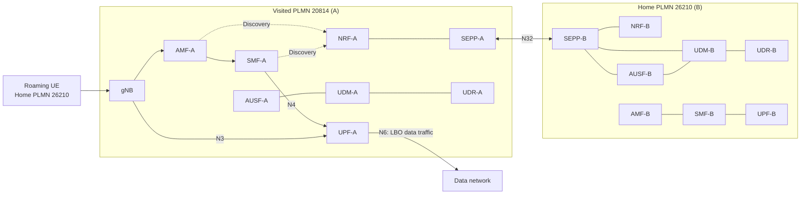

# End-to-end 5G SA LBO roaming with OAI 5G Core Network

This example connects a UE from home PLMN **26210** to visited PLMN **20814**. The home network provides authentication and subscriber information. A data traffic test is performed as LBO traffic through the visited network.



All deployed NFs are shown; lines summarize the roaming path, not every interface.

## 1. Prerequisites: build the images

Build required images by running `build_images.sh` from the SEPP repository:

```bash
cd scripts/test
./build_images.sh
```

The script builds all core NFs first, then UERANSIM. The uploaded roaming changes use `lbo-roaming-support`; AUSF and UPF remain on `develop`.

| Component | Branch | Image tag |
|---|---|---|
| AMF, SMF, NRF, UDM, UDR | `lbo-roaming-support` | `oai-<nf>:roaming-lbo` |
| AUSF, UPF | `develop` | `oai-<nf>:roaming-lbo` |
| SEPP | Repository default | `oai-sepp:roaming-lbo` |
| UERANSIM | Repository default | `ueransim:roaming-lbo` |

Core NF sources are from [OpenAirInterface](https://github.com/openairinterface). SEPP uses this checkout's origin repository. UERANSIM uses [rohanrkharade/UERANSIM](https://github.com/rohanrkharade/UERANSIM). Set `SEPP_BRANCH=master` if that branch is required.

## 2. Start both networks

From `scripts/test`:

```bash
docker compose -f docker-compose-basic-nrf-lbo-roaming.yaml up -d
python3 align_sepp_interfaces.py
docker compose -f docker-compose-basic-nrf-lbo-roaming.yaml ps
```

Use `docker-compose` instead if the host has Compose v1. The UE keeps its **50-second startup delay**.

| Test setting | Value |
|---|---|
| UE | `imsi-262100000000031` |
| Home → visited PLMN | `26210` → `20814` |
| DNN | `oai` |
| Slice | SST `222`, SD `00007B` |

Network settings are in `conf/roaming_config_partnerA.yaml` and `conf/roaming_config_partnerB.yaml`. The UE uses `conf/ueransim/ue-plmnB.yaml`. Existing database volumes are preserved.

## 3. Run and verify

The UE automatically registers, establishes its PDU session, and performs the LBO data traffic test.

```bash
docker logs -f ue-plmnB-roaming-A
docker exec ue-plmnB-roaming-A nr-cli imsi-262100000000031 -e status
docker exec ue-plmnB-roaming-A nr-cli imsi-262100000000031 -e ps-list
```

Confirm successful registration, an active IPv4 session on `oai`, and successful data traffic through the visited UPF.

## 4. Logs and LBO test capture

| Artifact | Visited PLMN (A) | Home PLMN (B) |
|---|---|---|
| AMF | [AMF-A](../scripts/test/logs/oai-amf-A.txt) | [AMF-B](../scripts/test/logs/oai-amf-B.txt) |
| SMF | [SMF-A](../scripts/test/logs/oai-smf-A.txt) | [SMF-B](../scripts/test/logs/oai-smf-B.txt) |
| UPF | [UPF-A](../scripts/test/logs/oai-upf-A.txt) | [UPF-B](../scripts/test/logs/oai-upf-B.txt) |
| NRF | [NRF-A](../scripts/test/logs/oai-nrf-A.txt) | [NRF-B](../scripts/test/logs/oai-nrf-B.txt) |
| AUSF | [AUSF-A](../scripts/test/logs/oai-ausf-A.txt) | [AUSF-B](../scripts/test/logs/oai-ausf-B.txt) |
| UDM | [UDM-A](../scripts/test/logs/oai-udm-A.txt) | [UDM-B](../scripts/test/logs/oai-udm-B.txt) |
| UDR | [UDR-A](../scripts/test/logs/oai-udr-A.txt) | [UDR-B](../scripts/test/logs/oai-udr-B.txt) |
| SEPP | [SEPP-A](../scripts/test/logs/oai-sepp-A.txt) | [SEPP-B](../scripts/test/logs/oai-sepp-B.txt) |
| Roaming UE | [UE log](../scripts/test/logs/ueransim-vplmnA.txt) | — |
| LBO test PCAP | [Download capture](../scripts/test/logs/oai-5gc-lbo-roaming.pcap) | Both PLMNs |

[All logs](../scripts/test/logs/) · [Test details](../scripts/test/logs/results.json) · [Image manifest](../scripts/test/logs/manifest.json)

Selected excerpts from the same run follow; log tables are reformatted for readability.

**LBO data traffic — UE ping**

```text
PING google.com (142.251.31.113) from 12.1.1.130 uesimtun0: 56(84) bytes of data.
64 bytes from 142.251.31.113: icmp_seq=1 ttl=105 time=32.2 ms
64 bytes from 142.251.31.113: icmp_seq=2 ttl=105 time=25.9 ms
64 bytes from 142.251.31.113: icmp_seq=3 ttl=105 time=24.4 ms

--- google.com ping statistics ---
3 packets transmitted, 3 received, 0% packet loss, time 2002ms
rtt min/avg/max/mdev = 24.443/27.509/32.204/3.370 ms
```

**Visited AMF-A Logs**

```text
2026-09-19T19:52:34.348425963Z [2026-09-19 21:52:34.348] [amf_app] [debug] Handle NF Update response
2026-09-19T19:52:34.348443557Z [2026-09-19 21:52:34.348] [amf_app] [debug] Set a timer to the next Heart-beat (10)
2026-09-19T19:52:42.829208561Z [2026-09-19 21:52:42.828] [amf_app] [info] 
2026-09-19T19:52:42.829286469Z    |------------------------------------------------------------------------------------------------------------------------------------------------------------|
2026-09-19T19:52:42.829300953Z    |----------------------------------------------------------------------gNBs' Information---------------------------------------------------------------------|
2026-09-19T19:52:42.829310499Z    |  Index |               Status               |              Global Id             |              gNB Name              |                PLMN                |
2026-09-19T19:52:42.829319242Z    |    1   |              Connected             |                0x01                |        UERANSIM-gnb-208-14-1       |               208,14               |
2026-09-19T19:52:42.829327904Z    |------------------------------------------------------------------------------------------------------------------------------------------------------------|
2026-09-19T19:52:42.829336693Z 
2026-09-19T19:52:42.829344333Z    |-----------------------------------------------------------------------------------------------------------------------------------------------------------|
2026-09-19T19:52:42.829353852Z    |---------------------------------------------------------------------UEs' Information----------------------------------------------------------------------|
2026-09-19T19:52:42.829362488Z    |  Index |     5GMM State     |                IMSI/SUPI               |        GUTI        |   RAN UE NGAP ID   |   AMF UE NGAP ID   |        PLMN        |       Cell Id      |
2026-09-19T19:52:42.829371230Z    |    1   |   5GMM-REGISTERED  |             262100000000031            |20814010041304846098|        0x01        |        0x03        |       208,14       |      000000010     |
2026-09-19T19:52:42.829380617Z    |-----------------------------------------------------------------------------------------------------------------------------------------------------------|
2026-09-19T19:52:42.829427179Z 
2026-09-19T19:52:44.349078435Z [2026-09-19 21:52:44.348] [amf_sbi] [info] Receive Update NF Instance Request, handling ...
```

**Visited SMF-A Logs**
```text
2026-09-19T19:31:15.922411674Z [2026-09-19 21:31:15.922] [smf_app] [info] Set upCnxState to UPCNX_STATE_ACTIVATED
2026-09-19T19:31:15.922701774Z [2026-09-19 21:31:15.922] [smf_app] [info] SMF context: 
2026-09-19T19:31:15.922747441Z  
2026-09-19T19:31:15.922759967Z SMF CONTEXT:
2026-09-19T19:31:15.922769874Z SUPI:				imsi-262100000000031
2026-09-19T19:31:15.922783269Z PDU SESSION:				
2026-09-19T19:31:15.922797801Z 	PDU Session ID:			1
2026-09-19T19:31:15.922813833Z 	DNN:			oai
2026-09-19T19:31:15.922861195Z 	S-NSSAI:			sst, sd: 222, 00007b
2026-09-19T19:31:15.922873996Z 	PDN type:		IPV4
2026-09-19T19:31:15.922888123Z 	PAA IPv4:		12.1.1.130
2026-09-19T19:31:15.922904070Z 	Default QFI:		No QFI available
2026-09-19T19:31:15.922919173Z 	SEID:			2
2026-09-19T19:31:15.922934381Z 	N3:
2026-09-19T19:31:15.922948132Z - UPF Graph Edge
2026-09-19T19:31:15.922961897Z   + Interface Type.............................: N3
2026-09-19T19:31:15.922975836Z   + NWI........................................: 
2026-09-19T19:31:15.922990994Z   + Uplink.....................................: No
2026-09-19T19:31:15.923005025Z   + PDR ID.....................................: 1
2026-09-19T19:31:15.923019876Z   + FAR ID.....................................: 2
2026-09-19T19:31:15.923034758Z 
2026-09-19T19:31:15.923049773Z 
2026-09-19T19:31:15.923062085Z [2026-09-19 21:31:15.922] [smf_app] [debug] Send request to N11 to triger FlexCN, SMF Context ID 0x2 
```

**Visited UPF-A Logs**

```text
2026-09-19T18:59:19.771164931Z [2026-09-19 20:59:19.771] [upf_n4 ] [info] pfcp_session::get(fteid) seid 0x1 
2026-09-19T18:59:19.771263892Z [2026-09-19 20:59:19.771] [upf_n4 ] [info] pfcp_session::add(pdr) seid 0x1 
2026-09-19T18:59:19.771305767Z 
2026-09-19T18:59:19.771325713Z +--------------------------------------------------------------------------------------------------------------------------------------------------------------------------------------------------+
2026-09-19T18:59:19.771343150Z | PFCP switch Packet Detection Rule list ordered by established sessions:                                                                                                                          |
2026-09-19T18:59:19.771359808Z +----------------+----+--------+--------+------------+---------------------------------------+----------------------+----------------+-------------------------------------------------------------+
2026-09-19T18:59:19.771375499Z |  SEID          |pdr |  far   |predence|   action   |        create outer hdr         tun id| rmv outer hdr  tun id|    UE IPv4     |                                                             |
2026-09-19T18:59:19.771431166Z +----------------+----+--------+--------+------------+---------------------------------------+----------------------+----------------+-------------------------------------------------------------+
2026-09-19T18:59:19.771458353Z |0000000000000001|0001|00000001|00000000|ACC>---->COR|none                                   |GTPU_UDP_IPV4:00000001|12.1.1.130      |
2026-09-19T18:59:19.771478253Z +--------------------------------------------------------------------------------------------------------------------------------------------------------------------------------+
2026-09-19T18:59:19.771495321Z 
2026-09-19T18:59:19.840154722Z [2026-09-19 20:59:19.839] [upf_n4 ] [info] handle_receive(191 bytes)
2026-09-19T18:59:19.840325960Z [2026-09-19 20:59:19.840] [upf_app] [info] Received N4_SESSION_MODIFICATION_REQUEST seid 0x1 
2026-09-19T18:59:19.840352689Z [2026-09-19 20:59:19.840] [upf_n4 ] [info] pfcp_session::add(far) seid 0x1 
2026-09-19T18:59:19.840401900Z [2026-09-19 20:59:19.840] [upf_n4 ] [info] pfcp_session::add(pdr) seid 0x1 
2026-09-19T18:59:19.840427521Z 
2026-09-19T18:59:19.840439118Z +--------------------------------------------------------------------------------------------------------------------------------------------------------------------------------------------------+
2026-09-19T18:59:19.840454807Z | PFCP switch Packet Detection Rule list ordered by established sessions:                                                                                                                          |
2026-09-19T18:59:19.840471523Z +----------------+----+--------+--------+------------+---------------------------------------+----------------------+----------------+-------------------------------------------------------------+
2026-09-19T18:59:19.840486060Z |  SEID          |pdr |  far   |predence|   action   |        create outer hdr         tun id| rmv outer hdr  tun id|    UE IPv4     |                                                             |
2026-09-19T18:59:19.840504624Z +----------------+----+--------+--------+------------+---------------------------------------+----------------------+----------------+-------------------------------------------------------------+
2026-09-19T18:59:19.840526053Z |0000000000000001|0001|00000001|00000000|ACC>---->COR|none                                   |GTPU_UDP_IPV4:00000001|12.1.1.130      |
2026-09-19T18:59:19.840541948Z |0000000000000001|0002|00000002|00000000|COR>---->ACC|GTPU_UDP_IPV4:192.168.71.140  :00000001|none                  |12.1.1.130      |
2026-09-19T18:59:19.840553115Z +--------------------------------------------------------------------------------------------------------------------------------------------------------------------------------+
2026-09-19T18:59:19.840563865Z 
2026-09-19T18:59:19.930376664Z [2026-09-19 20:59:19.930] [pfcp_switch] [info] PDR/PDI IP is 8201010c 
```

To refresh complete logs, wait for AMF-A's periodic table to show `5GMM-REGISTERED` after the traffic test, then run:

```bash
python3 capture_lbo_logs.py --output logs
```


## 5. Stop

```bash
docker compose -f docker-compose-basic-nrf-lbo-roaming.yaml down
```